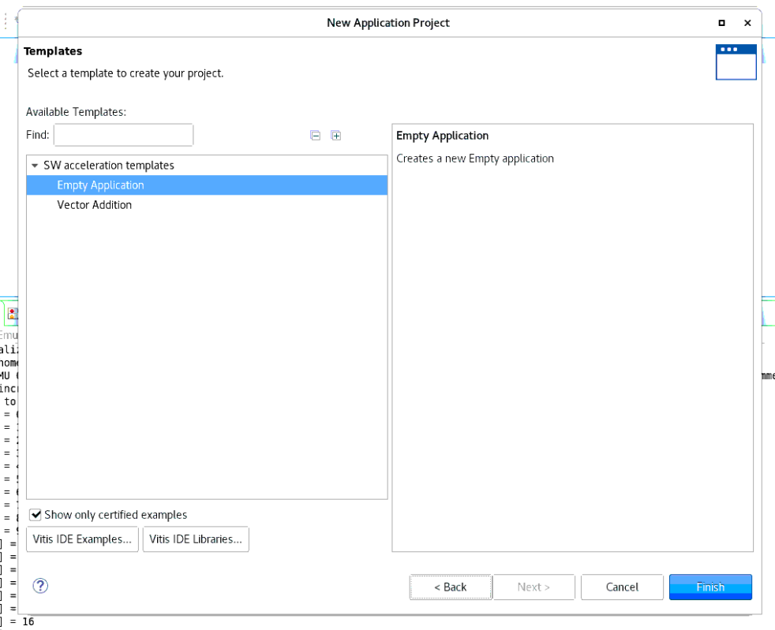
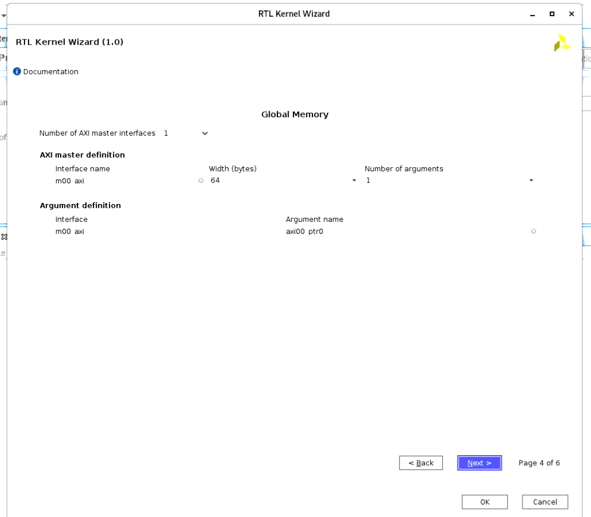
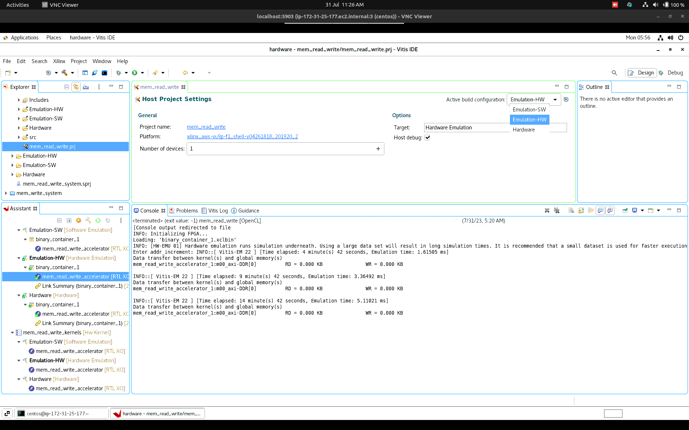

<div style="text-align: justify">

# Memory access and bandwidth test using Vitis on AWS F1 hardware acceleration FPGA instance on Alveo Board

## Design Overview

 


  In this task we have designed a simplistic design to read memory from the SDRAM of the Host Machine through PCIe bus to DDR of FPGA and then to FPGA block memory and write memory the same way back. Vitis IDE is used to generate the link using AXI4 Lite protocol to get all the control signal communication done. From the Host side of the system, we are using OpenCL (OCL / Open Computing Language) to access the XRT library and communicate through the PCIe bus and the DMA (Direct Memory Access) modules which would be built by Vitis at the FPGA side when the kernels are built. There are three main module designs in this test as below. 

    mem_read

    mem_write

    mem_read_write

Below is the block diagram of the test subject structure.

<div style="text-align: center">

</div>

## mem_read module:


  The function of mem_read is to read data from DDR of the FPGA Card to FPGA chip's block memory as fixed size chunks (which later will be upgraded as a user configuration inputs in future updates) using AXI4 by following the addr_increment to advance the address reference to start the next memory chunk. And mem_max_addr scalar variable to end the reading function from DDR, both of addr_increment and mem_max_addr are provided by the Host Program. Below is the block diagram of the mem_read module. 

<div style="text-align: center">

</div>

## mem_write module:

  mem_write module is writing fixed size data chunks into the DDR in FPGA card from FPGA chip's block memory using AXI4 Memory Mapped Protocol with the addr_increment and mem_max_addr scalar arguments provided from Host Program Side like in mem_read module. below, is the block diagram of the meme_write module.

<div style="text-align: center">

</div>

## mem_read_write module:

  mem_read_write is an integration of mem_read and mem_write modules into one module to do both read and write functions together.
  All of above modules are using the wrapper modules axi_read_maser and axi_write_master, which was provided by Xilix Vitis, will communicate with DDR of the FPGA card. Following Figure demostrate the block diagram of mem_read_write and the architecture for above.

<div style="text-align: center">

</div>
  The mxx_axi wrapper module:

<div style="text-align: center">

</div>

## Design Flow

  The design flow pathway includes below steps:
  
<div style="text-align: left">

  1.  Creation of the C++ behavioral model of the RTL model to be designed and tests.
     
  
        a.  C++ based behavioral design model header (.h) file of RTL model to be designed. 
        
        b.  C++ source code (.cpp) file where all the definition is described of the class methods and variables. 
  2.  Designing of the RTL model written in SystemVerilog and Verilog.
  3.  COCOTB test bench written in python which asserts the C++ behavioral model, that was created earlier, with the    RTL model simulation outputs. 
  
</div>


## Running the Test

Since Hardware  Acceleration happened to be improving an already made software architecture, reverse engineering on the software design has to take place in case of figuring out the boundaries to indicate the host side of the acceleration and the hardware offloading side of the acceleration, in such task once the boundaries are defined converting the software instructions into hardware kernel is the first phase of the design.So we first make the behavioral model of what we are going to hardware offload in C++ in a OOP based structure where pointers would be used for both array starting addresses and enabling referencing the output variables like deceleration of outputs in SystemVerilog. The status are simply defined in a ‘enum’ block and switch statement would be use to define the role of the statement in the design. Once the C++ class of the behavioral model is done, the next phase is to run the behavioral tests on the model using it as a function, in here we would use the model in a for or while loop in the main function tracking the count of iterations with a print and one iteration would be considered as once clock cycle of the behavioral model test. once the behavioral model test passes the desired behavior of our design, we can start building the RTL kernel using our verified C++ behavioral model of our design, which would make it easier for us to manage the designing procedure much accurate and simpler in action.

Once we make the RTL model the next process is to write the test bench in python to use COCOTB to run our RTL kernel using a desired simulator (in our case Icarus Verilog) and assert it with the behavioral model we made earlier with C++ by wrapping it with Cython, so the C++ class can be called in python fro assertion. This way, 75% of front end of the design is being done before we go for the Hardware Emulation for further testing. After ending the back and forth between the Behavioral Model and the RTL kernel Design once we are satisfied with the test results, the next phase is to plug our RTL in to the Hardware Emulation Environment provided by Vitis with the Environment conditional parameters we supplied to it. In Hardware Emulation, we have both the Host program side and the RTL kernel side to take care of, which would be explained below in detail.

Once the Hardware Emulation is tested successfully, we can move on to compile the code and make an AWS FPGA Image to run the design in actual Hardware and do further debugging to tailor it as a product. Below is the elaboration of Design Flow as introduced above.


## Runnig the behavioral model tests

In here, the complete process of testing and compilation is being  handled by Makefile Automation using Bash Script. Therefore running a test is just a matter of calling the make command after changing directory in to the main folder of the related Behavioral Model as shown below.

``` 
cd <path to repositary>/cpp/alveo_mem_test_experiments/<test_folder>
make <test name as in the cpp test file name> 
./<test name as in the cpp test file name> 
```
Example:
```
cd <path to repositary>/cpp/alveo_mem_test_experiments/mem_read
make mem_read_test 
./mem_read.exec 
```
type below for cleaning the generated files after use
`make clean`

## Running COCOTB simulation test

follow the below commands to run the COCOTB tests locate the simulation in the sim directory of the repository.

```
cd <path to repositary>/sim/alveo_mem_test_experiments/<test_folder>
make
```
type below for clearing the generated files after use.

`make clean`

**Note: Please make sure that you follow the instructions written in comments in the RTL design code before use them since there has to be uncomment and comment some lines when using in different tests and on the hardware run.**

## Running Hardware Emulation on the design

comment the `& ~LP_ADDR_MASK` of axi_read_master and axi_write_master since we already take care of the 4Kbyte masking from Host side.

```
    addr_offset_r <= ctrl_addr_offset /*& ~LP_ADDR_MASK*/;
```
- Open Vitis by typing ‘vitis’ in the terminal.
- Choose a preferred Workspace directory for yourself and click 'Launch'.

<div style="text-align: center">

</div>

- Go to File->New->Application Project.
- Skip the information page by clicking next.
- Assuming you have cloned the AWS-fpga repository from the web, select the platform for the particular board and  click next.

<div style="text-align: center">

</div>

- Give a project name, for an example, for <project name> RTL kernel, name it as '<project name>' and click next.

<div style="text-align: center">

</div>
- select as Empty Application and click finish.

<div style="text-align: center">

</div>

- Go to **Xilinx->Launch RTL Kernel Wizard.**
  
gather all the RTL design files in to a single folder
open terminal in that folder and use the following command to transfer all the SystemVerilog and Verilog files into the import folder in project folder using below command.

```
scp -i <key file name>.pem ./*.* <username>@<ip address>:<path to workspace>/<project name>_kernels/vivado_rtl_kernel/<project name>_accelerator_ex/imports

```
**
note that the location of the files and folders in your AWS development instance would depend on the workspace location you select
**
skip the introduction page  for later by  clicking next. In General Settings define the Kernel Name, Kernal Vender, Kernel Type(RTL), Has reset (1) and click next

<div style="text-align: center">

</div>

- set up the scalar arguments you want to send to the kernel and click next once finished.

<div style="text-align: center">  

</div>

in Global Memory page set up each AXI master interfaces you want for the connection with the Global Memory. and click next.

<div style="text-align: center">

</div>

skip the Streaming interfaces since we are using axi 4 Lite, click next. and you would be provided a summary of what you have been created and the parameters you want to manage in your host program (i.e. ID, Name of scalar argument variable)

<div style="text-align: center">

</div>

then click OK.

- Once the Vivado window is open, remove all the Design Sources .sv and .v files and import all the files we scp earlier from our local machine repository. 

- Click Generate RTL Kernel if the Design source file hierarchy is settled. and click OK on next window appear as below. 

<div style="text-align: center">

</div>

- Lead back to Vitis following the flow.

- Add xrt.ini text file to <path to workspace>/<project name>/Emulation-HW/ which contain context as below.

```
[Emulation]
debug_mode=gui
```

- Next, adding a hardware function, in Assistant tab right click on <project name>_kernels/Emulation-HW [Hardware Emulation]

- click on add a binary container

<div style="text-align: center">

</div>

- Right click on the binary_container_1 and on the coming menu, click on Add Hardware Function…

<div style="text-align: center">

</div>

- And select a hardware function (<project name>_accelerator)

<div style="text-align: center">

</div>

- Right click again on the hardware function you added earlier on the same path in Assistant tab list, click on Settings from the following
menu. and type
```
-g --connectivity.sp <project name>_accelerator_1.out_data:DDR[0] --connectivity.slr <project name>_accelerator
```

- In the V++ linker options: text box to enable editing. And click Apply and Close once done (replace <project name> with the test name
you are currently testing).
- In Explorer tab list, right click on <project name>_system/<project name>/src and click on Import Sources…

<div style="text-align: center">

</div>

- Brows and locate both the .cpp and .h files and add them.
- In Explorer, click on <project name>, and double click <project name>_system.sprj
- Select Hardware Emulation from Active build configuration.

<div style="text-align: center">

</div>

- go to Project -> Clean.

<div style="text-align: center">

</div>

- follow the instructions.
- Check every folder and press clean.

<div style="text-align: center">  

</div>

- Click on Run Configurations… as shown below once build is done.

<div style="text-align: center">

</div>

- Specify the kernel name and requesting data with the window shown below.

<div style="text-align: center"> 

</div>

- Enter the argument as binary_container_1.xclbin

<div style="text-align: center">

</div>

- Then run and pause the Vivado runtime putting the information window to run on background.
- Now drag and drop the signals you want to view on the Waveform window, and resume the Emulation.
- **Enjoy!!**

## Running on Hardware

- Log in to Dev server.
- the source of binary_container_1.xclbin : `<path to the workspace>/<project
name>_system_hw_link/Hardware/binary_container_1.xclbin`
   - create a directory at different location

  `mkdir <file path>/<project name>_hw_xclbin/release_x`
   - go to the directory and copy the xclbin and ltx files there
To execute the application on F1, the following files are needed:
- Host application (executable file)
- Amazon FPGA Image (awsxclbin)

The awsxclbin is an Amazon specific version of the FPGA binary file (xclbin) produced by the Vitis software.
The awsxclbin can be created by running the create_vitis_afi.sh script which is included in the aws-fpga GitHub repository.
The script can be found in the following location in the aws-fpga repository:

```
$VITIS_DIR/tools/create_vitis_afi.sh
```

1. Before running the commands below, make sure the Vitis setup script has been sourced (the following command assumes the aws-fpga
Git repository is cloned to the user home area)

```
source ~/aws-fpga/vitis_setup.sh
```
2. Set up S3 bucket region
For instance:
   
```
aws configure set region us-east-1
```
Note: the region may change for your instance. This command will create/update the `~/.aws/config` file

3. Create an AFI by running the create_vitis_afi.sh script and wait for the completion of the AFI creation process

```
$VITIS_DIR/tools/create_vitis_afi.sh -xclbin=<filename>.xclbin -s3_bucket=<bucket-name> -s3_dcp_key=<dcp-folder-name> -s3_logs_key=<logs-folder-name>
```
n the above command, set your *xclbin* file as `<filename>`; the Amazon S3 `<bucket-name>`, `<dcp-folder-name>`, and `<logs-folder-name>` with the names you had given when running CLI script. You can choose any valid folder name for the dcp and logs folder. The Amazon S3 bucket name should match an S3 bucket you have set up.

Learn more about setting up S3 buckets [here](https://github.com/aws/aws-fpga/blob/master/Vitis/docs/Setup_AWS_CLI_and_S3_Bucket.md) for later reading!

The `create_vitis_afi.sh script` does the following:

- Starts a background process to create the AFI
- Generates a `*_afi_id.txt` which contains the FPGA Image Identifier (or AFI ID) and Global FPGA Image Identifier (or AGFI ID) of the generated AFIs
- Creates the `*.awsxclbin` AWS FPGA binary file which is passed to the host application to determine which AFI should be loaded to the FPGA.
- Uploads the `*.xclbin` to the AWS cloud for processing.
- cat the file `*_afi_id.txt` and figure out the afi and agfi IDs of the AFI generated
  - use the following command to check the availability of the AFI
- `aws ec2 describe-fpga-images --fpga-image-ids afi-<afi id>` (get the AFI from cat output)
- Or you can automate :` aws ec2 describe-fpga-images --fpga-image-ids $(cat *afi_id.txt | sed -n '2p' | tr -d '",' | sed 's/.*://')`
Note: When AFI creation is in progress, the State will be pending. When the AFI creation is finished, the output should show available:

```
"State": {
       "Code": "available"
},
```
- copy the generated awsxclbin and ltx files to S3 bucket
  aws s3 cp binary_container_1.awsxclbin s3://<bucket URL>
  aws s3 cp binary_container_1.ltx s3://<bucket URL>

- Wait until the AFI becomes available before proceeding to execute on the F1 instance.
ssh to remote machine with AWS F1 instance
`ssh -L 5904:localhost:5904 -i <key file name>.pem <user>@<ip address of the aws server>`
- source vitis runtime set up on F1 instance terminal
  `source <workspace>/aws-fpga/vitis_runtime_setup.sh`

- go to <project name> folder on f1 instance server and copy the awsxclbin and ltx files from S3 bucket to there
`cd <workspace>/<project name>/` 
`aws s3 cp s3://<s3 bucket name>/binary_container_1.awsxclbin ./`
`aws s3 cp s3://<s3 bucket name>/binary_container_1.ltx ./`

copy the OpenCL interface Source file and Header file to the above folder as well from local machine or Developer instance using scp

```
g++ -std=c++0x -D__USE_XOPEN2K8 -I/opt/xilinx/xrt/include/ -I/opt/Xilinx/Vivado/2020.2/include/ -O2 -g -Wall -fmessage-length=0 <shell source name>.cpp -o <project name>.exec -lxilinxopencl -lpthread -lrt -lstdc++ -L/opt/xilinx/xrt/lib/ -Wl,-rpath-link,/opt/xilinx/xrt/lib
```
- run the HW unit test
  `./<project name>.exec binary_container_1.awsxclbin`

the below method defined in your host program after the complete initiation of FPGA, makes the host program to wait till ILA (Integrated Logic Analyzer) triggers are made and the user press ENTER once done. (more on https://github.com/aws/aws-fpga/blob/master/hdk/docs/Virtual_JTAG_XVC.md) 

```
void <shell source name>::wait_for_enter(const std::string& msg){

std::cout << msg << std::endl;

std::cin.ignore(std::numeric_limits<std::streamsize>::max(), '\n';)

}
```

- once you run the host program including the above method in the end of initiation method of the code 
- open another terminal and start the virtual JTAG which would be use for run time analysis with below command in a terminal of F1 instance 

`sudo fpga-start-virtual-jtag -P 10201 -S 0`

## Connecting Xilinx Hardware Manager (Vivado Lab Edition) running on local F1 instance to the Debug Target FPGA-enabled EC2 Instance

1. Launch Vivado Lab Edition (or full featured Vivado)
2. Select “Open HW Manager” 
3. Start Vivado hw_server using the following command in Vivado's .Tcl console
  `connect_hw_server`
4. Connect to the target instance Virtual JTAG XVC server using the following command in Vivado's tcl console.
   `open_hw_target -xvc_url localhost:10201`
Upon successful connection, Vivado's Hardware panel will be populated with a debug bridge instance.

5. Select the debug bridge instance from the Vivado Hardware panel
You will need a "Probes file" in the next step.  A "Probes file" with an ".ltx" extension is generated during the build process and written to the checkpoints directory.
6. In the Hardware Device Properties window select the appropriate “Probes file” for your design by clicking the icon next to the “Probes file” entry, selecting the file, and clicking “OK”. This will refresh the hardware device and it should now show the debug cores present in your design. Note the Probes file is written out during the design implementation, and is typically has the extension ".ltx". In hardware device properties in properties tab under FULL_PROBES enter the file path to *.ltx file and press enter
7. right click on the debug_bridge and select refresh device.
8. in the Trigger Setup tab beneath the waveform window, click the + button to add a trigger probe and set up a trigger condition, select s_axi_control: ARVALID
9. Set the value condition of the trigger probe to 1
10. Select an or operation to combine the probes.
11. Now in the Waveform window, click toggle the auto trigger button to be switched on and click the play button to get the waveform of the running model.
12. Now go to the terminal where the host program was running and waiting for the Enter button to be pressed after creating ILA trigger and press Enter.
13. ***Voila!***

</div>